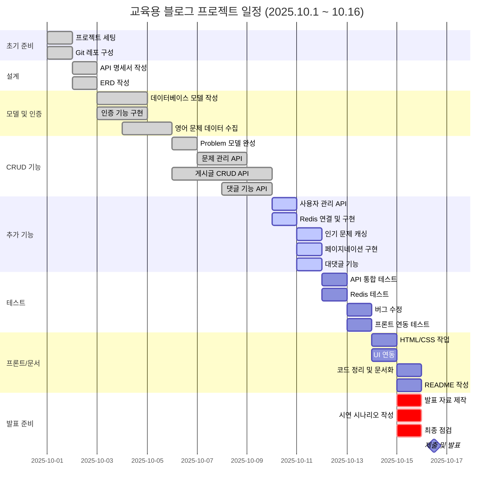

# 🎓 영어교육용 블로그 프로젝트

FastAPI 기반의 영어 교육 플랫폼으로, 입시 정보 공유와 영어 학습을 지원하는 종합 블로그 서비스입니다.

---

## 📋 목차

- [프로젝트 개요](#-프로젝트-개요)
- [주요 기능](#-주요-기능)
- [기술 스택](#-기술-스택)
- [프로젝트 구조](#-프로젝트-구조)
- [데이터베이스 스키마](#-데이터베이스-스키마)
- [설치 및 실행](#-설치-및-실행)
- [API 문서](#-api-문서)
- [프로젝트 일정](#-프로젝트-일정)
- [트러블슈팅](#-트러블슈팅)
- [배운 점](#-배운-점)

---

## 🌟 프로젝트 개요

이 프로젝트는 JWT 인증, 게시글 CRUD, 댓글 기능, 문제 선택 기능을 포함한 종합 블로그 플랫폼입니다.

## 🌟 주요 역할

#### 1️⃣ 관리자
- 게시글 작성 및 삭제 권한
- 영어 문제 등록 기능
- 인기 문제 통계 확인
- 데이터 기반 서비스 정교화 가능

#### 2️⃣ 사용자
- 게시글 읽기 전용
- 영어 문제 선택 및 마이페이지 저장
- 향후 선택한 문제 기반 AI 변형 문제 서비스의 소비자

---

## 🌟 주요 기능

### 1️⃣ 게시판 기능
- **입시정보 게시판**: 대학 입시 일정, 전형 정보, 수시/정시 전략 제공
- **영어지식 게시판**: 영어 문법, 학습 방법론, 문제 유형별 접근법 공유
- 게시글 CRUD (생성, 조회, 수정, 삭제)
- 검색 및 필터링
- 페이지네이션
- 태그 기반 분류

### 2️⃣ 문제 선택 및 관리
- 영어 문제 선택 (연도 → 월 → 문제 번호)
- 마이페이지에서 선택한 문제 관리 및 조회
- Redis 기반 인기 문제 Top 10 추적
- 문제 선택 이력 관리

---

## 🛠 기술 스택

### Backend
- **Python**: 3.9+
- **FastAPI**: 웹 프레임워크
- **SQLAlchemy**: ORM
- **SQLite**: 데이터베이스
- **Redis**: 캐싱 및 인기 문제 추적
- **JWT**: 인증/인가

### Frontend
- **HTML/CSS/JavaScript**: UI 구현
- **Jinja2**: 템플릿 엔진

---

## 📁 프로젝트 구조

```
project/
├── main.py                 # FastAPI 애플리케이션 진입점
├── database.py             # 데이터베이스 연결 설정
├── requirements.txt        # 의존성 목록
├── create_admin.py         # 관리자 계정 생성 스크립트
│
├── models/                 # SQLAlchemy 모델
│   ├── user.py            # 사용자 모델
│   ├── problem.py         # 문제 모델
│   ├── post.py            # 게시글 모델
│   └── comment.py         # 댓글 모델
│
├── routers/                # API 라우터
│   ├── auth.py            # 인증 API
│   ├── problem.py         # 문제 관련 API
│   ├── blog.py            # 게시글 API
│   └── comment.py         # 댓글 API
│
├── utils/                  # 유틸리티 함수
│   └── dependencies.py    # JWT 인증 등
│
├── templates/              # HTML 템플릿 파일
├── static/                 # 정적 리소스 (CSS, 이미지 등)
│
├── uploads/                # 업로드된 파일
│   ├── posts/             # 게시글 이미지
│   └── problems/          # 문제 파일
│
├── blog.db                 # SQLite 데이터베이스
├── ERD.png                # 데이터베이스 ERD
└── README.md              # 프로젝트 문서
```

---

## 🗄 데이터베이스 스키마


### 핵심 테이블

#### User (사용자)
- 사용자 정보 관리
- **주요 필드**: user_id, email, password, name, nickname, role
- **역할**: 일반 사용자(user) / 관리자(admin)

#### Problem (영어 문제)
- 영어 기출 문제 정보
- **주요 필드**: problem_id, year, month, number, title, file_url, difficulty
- **특징**: 연도별/월별 문제 관리, 난이도 설정 가능

#### UserProblem (사용자-문제 선택)
- 사용자가 선택한 문제 이력 관리
- **주요 필드**: user_problem_id, user_id, problem_id, selection_count
- **특징**: 문제 선택 횟수, 최초/최근 선택 시간 추적

#### Post (게시글)
- 게시글 정보 관리
- **주요 필드**: post_id, user_id, title, content, category, image_url, view_count
- **카테고리**: 입시정보, 영어지식 등
- **특징**: 조회수 추적, 이미지 첨부 가능

#### Comment (댓글)
- 게시글 댓글 및 대댓글
- **주요 필드**: comment_id, post_id, user_id, parent_comment_id, content
- **특징**: 계층형 구조 (대댓글 지원)

#### Tag (태그)
- 게시글 분류용 태그
- **주요 필드**: tag_id, name

#### PostTag (게시글-태그 연결)
- 게시글과 태그의 다대다 관계 관리
- **주요 필드**: post_tag_id, post_id, tag_id
---

## 🚀 설치 및 실행

### 1. 가상환경 생성 및 활성화

```bash
# Windows
python -m venv venv
venv\Scripts\activate

# macOS/Linux
python3 -m venv venv
source venv/bin/activate
```

### 2. 필요한 패키지 설치

```bash
pip install -r requirements.txt
```

### 3. Redis 설치 및 실행

**Windows:**
```bash
# Redis 다운로드 및 설치 (https://github.com/microsoftarchive/redis/releases)
# 설치 후 Redis 서버 실행
redis-server
```

**macOS:**
```bash
brew install redis
brew services start redis
```

**Linux:**
```bash
sudo apt-get install redis-server
sudo systemctl start redis
```

### 4. 환경변수 설정

프로젝트 루트에 `.env` 파일을 생성하고 다음 내용을 입력합니다:

```env
SECRET_KEY=your-secret-key-here
ALGORITHM=HS256
ACCESS_TOKEN_EXPIRE_MINUTES=30
```

### 5. 데이터베이스 및 관리자 계정 초기화

```bash
# 관리자 계정 생성 (테이블도 자동 생성됨)
python create_admin.py
```

**관리자 계정 정보:**
- 아이디: `admin`
- 비밀번호: `admin1234`
- 이메일: `admin@example.com`

### 6. 서버 실행

```bash
uvicorn main:app --reload
```

서버가 실행되면 `http://localhost:8000`에서 접속 가능합니다.

---

## 📚 API 문서

FastAPI는 자동으로 API 문서를 생성합니다.

- **Swagger UI**: http://localhost:8000/docs
- **ReDoc**: http://localhost:8000/redoc

### API 엔드포인트

**인증**
- `POST /auth/register` - 회원가입
- `POST /auth/login` - 로그인
- `GET /auth/me` - 내 정보

**게시글**
- `POST /blog` - 작성
- `GET /blog` - 목록 조회
- `GET /blog/{id}` - 상세 조회
- `PUT /blog/{id}` - 수정
- `DELETE /blog/{id}` - 삭제

**댓글**
- `POST /blog/{id}/comments` - 댓글 작성
- `POST /comments/{id}/replies` - 대댓글 작성

**문제**
- `GET /problems` - 문제 목록
- `POST /problems/my` - 문제 선택
- `GET /problems/my` - 내 문제 조회
- `GET /problems/popular` - 인기 문제 Top 10

---

## 📅 프로젝트 일정

**프로젝트 기간**: 2025년 10월 1일 ~ 10월 16일



---

## 🔧 개발 가이드

### Git 브랜치 전략
- `main`: 프로덕션 브랜치
- `develop`: 개발 브랜치
- `feature/*`: 기능 개발 브랜치

### 커밋 메시지 규칙
```
feat: 새로운 기능 추가
fix: 버그 수정
docs: 문서 수정
style: 코드 포맷팅
refactor: 코드 리팩토링
test: 테스트 코드
chore: 빌드 업무, 패키지 관리
```

---

## 🐛 트러블슈팅

### 1. 게시글 작성 시 404 권한 오류

**문제**: JWT 토큰 인증 실패로 404 에러 발생

**해결**:
```python
SECRET_KEY = "TEST-ASDASDASDASDASDASDASDSA"
ALGORITHM = "HS256"
ACCESS_TOKEN_EXPIRE_MINUTES = 30

oauth2_scheme = OAuth2PasswordBearer(tokenUrl="token")

def create_token(user_id: int):
    expire = datetime.utcnow() + timedelta(minutes=ACCESS_TOKEN_EXPIRE_MINUTES)
    token_data = {"sub": str(user_id), "exp": expire}
    return jwt.encode(token_data, SECRET_KEY, algorithm=ALGORITHM)
```

### 2. 게시글 작성 시 500 서버 오류

**문제**: Post 테이블에 `image_url` 컬럼 추가했지만 실제 DB에 반영 안 됨

**해결**: DB 재생성

### 3. 문제 중복 등록 방지 + selection_count 증가

**문제**: 같은 문제를 여러 번 선택할 때 중복 생성됨

**해결**:
```python
user_problem = db.query(UserProblem).filter(
    UserProblem.user_id == current_user.user_id,
    UserProblem.problem_id == request.problem_id
).first()

if user_problem:
    # 이미 선택한 문제면 카운트 증가
    user_problem.selection_count += 1
    user_problem.last_selected_at = datetime.utcnow()
else:
    # 새로 선택
    user_problem = UserProblem(
        user_id=current_user.user_id,
        problem_id=request.problem_id,
        selection_count=1,
        first_selected_at=datetime.utcnow(),
        last_selected_at=datetime.utcnow()
    )
    db.add(user_problem)

db.commit()
db.refresh(user_problem)

if redis_client:
    redis_client.zincrby("popular_problems", 1, request.problem_id)
```

### 4. 문제 삭제 시에도 Redis 인기도 유지

**비즈니스 로직**:
- 삭제 = 마이페이지 정리용
- 이미 서비스 이용 완료 & 과금 완료
- 인기도는 '실제 서비스 이용 횟수'이므로 삭제와 무관

**해결**:
```python
@router.delete("/my/{user_problem_id}")
def delete_my_problem(user_problem_id: int, ...):
    # Redis 인기도는 건드리지 않음
    db.delete(user_problem)
    db.commit()
    return {"message": "문제가 내 문제 목록에서 삭제되었습니다."}
```

---
## 🚀 향후 발전 계획

### AI 기반 학습 서비스
- 변형 문제 생성: 사용자가 선택한 문제를 기반으로 AI가 유사 난이도의 변형 문제 자동 생성

### 서비스 고도화
- 관리자 대시보드: 통계 분석 및 콘텐츠 관리 개선
- 사용자 활동 분석 (문제 선택 패턴, 인기 카테고리)

---
## 📖 배운 점

### 코드 효율성
- 효율적인 코드 작성 방법에 대한 고민
- 논리적인 코드 진행 방식과 오류 점검 프로세스 학습
- 개발자적 마인드 함양

### 기술적 성장
- FastAPI의 요청·응답 흐름 이해 심화
- 클라이언트/서버 구조에 대한 이해
- Redis를 활용한 캐싱 및 데이터 추적
- JWT 기반 인증/인가 시스템 구현

### 서비스 기획
- 정보 가치가 있는 블로그 설계
- 사용자 경험을 고려한 기능 구현
- 데이터 기반 서비스 정교화 방안 모색

---

## 👥 개발자 (팀원)
- 신가람, 이승철

**프로젝트 기간**: 2025.10.01 ~ 2025.10.16

---
