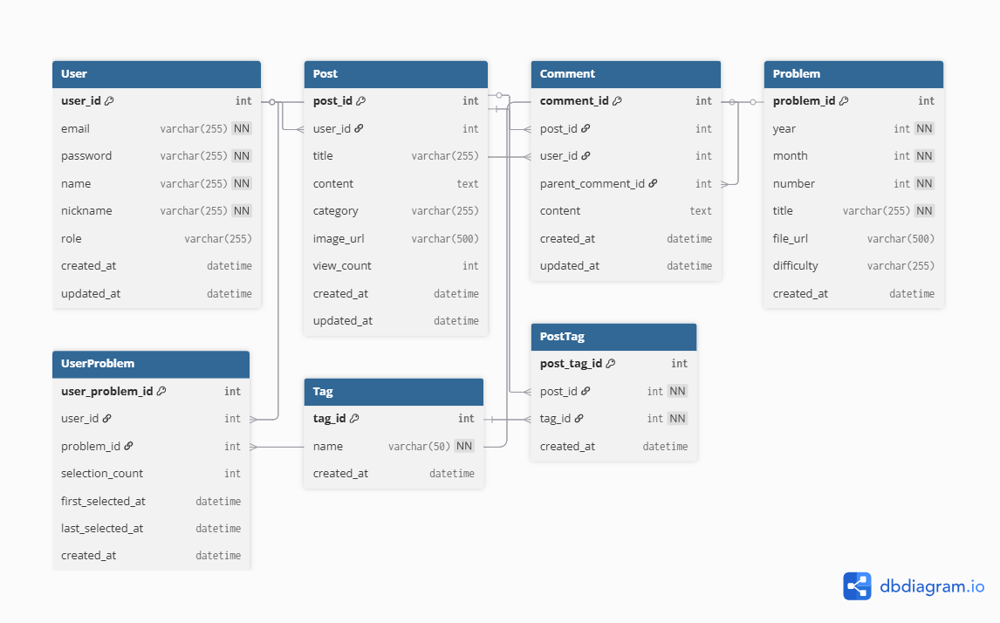

# 🎓 영어교육용 블로그 프로젝트

FastAPI 기반의 영어 교육 플랫폼으로, 입시 정보 공유와 영어 학습을 지원하는 종합 블로그 서비스입니다.

---

## 📌 프로젝트 개요

**프로젝트 기간**: 2025년 10월 1일 ~ 10월 16일 (16일)

이 프로젝트는 JWT 인증, 게시글 CRUD, 댓글 기능, 문제 선택 기능을 포함한 종합 교육 블로그 플랫폼입니다.

---

## 🌟 주요 기능

### 1️⃣ **게시판 기능**
- **입시정보 게시판**: 대학 입시 일정, 전형 정보, 수시/정시 전략 제공
- **영어지식 게시판**: 영어 문법, 학습 방법론, 문제 유형별 접근법 공유

### 2️⃣ **문제 선택 및 관리**
- 영어 문제 선택 (연도 → 월 → 문제 번호)
- 마이페이지에서 선택한 문제 관리 및 조회
- 향후 계획: 선택한 문제 기반 AI 변형 문제 생성 서비스 제공 

### 3️⃣ **커뮤니티 기능**
- 게시글별 댓글 및 대댓글 작성
- 계층형 댓글 구조 지원

---

## 🛠 기술 스택

### Backend
- **Python**: 3.9+
- **FastAPI**: 웹 프레임워크
- **SQLAlchemy**: ORM
- **SQLite**: 데이터베이스
- **Redis**: 캐싱 및 인기 문제 추적
- **JWT**: 인증/인가

### Frontend
- **HTML/CSS/JavaScript**: UI 구현
- **Jinja2**: 템플릿 엔진

---

## 📁 프로젝트 구조

```bash
project/
├── main.py                 # FastAPI 애플리케이션 진입점
├── database.py             # 데이터베이스 연결 설정
├── requirements.txt        # 의존성 목록
│
├── models/                 # SQLAlchemy 모델
│   ├── user.py            # 사용자 모델
│   ├── problem.py         # 문제 모델
│   ├── post.py            # 게시글 모델
│   └── comment.py         # 댓글 모델
│
├── routers/                # API 라우터
│   ├── auth.py            # 인증 API
│   ├── problem.py         # 문제 관련 API
│   ├── blog.py            # 게시글 API
│   └── comment.py         # 댓글 API
│
├── utils/                  # 유틸리티 함수
│   └── dependencies.py    # JWT 인증 등
│
├── templates/              # HTML 템플릿 파일
├── static/                 # 정적 리소스 (CSS, 이미지 등)
│
├── uploads/                # 업로드된 파일
│   ├── posts/             # 게시글 이미지
│   └── problems/          # 문제 파일
│
├── blog.db                 # SQLite 데이터베이스
└── README.md              # 프로젝트 문서
```

---

## 🗄 데이터베이스 스키마 (ERD)



### 주요 테이블
- **User**: 사용자 정보 (이메일, 비밀번호, 이름, 닉네임, 권한)
- **Problem**: 영어 문제 정보 (연도, 월, 번호, 제목, 파일, 난이도)
- **UserProblem**: 사용자-문제 선택 관계 (선택 횟수, 선택 시간)
- **Post**: 게시글 (제목, 내용, 카테고리, 이미지, 조회수)
- **Comment**: 댓글 (내용, 계층형 구조)
- **Tag**: 태그 (게시글 분류)
- **PostTag**: 게시글-태그 관계

---

## 📅 프로젝트 일정 (WBS)


---

## 🚀 설치 및 실행

### 1. 가상환경 생성 및 활성화

```bash
# Windows
python -m venv venv
venv\Scripts\activate

# macOS/Linux
python3 -m venv venv
source venv/bin/activate
```

### 2. 필요한 패키지 설치

```bash
pip install -r requirements.txt
```

### 3. Redis 설치 및 실행

**Windows:**
```bash
# Redis 다운로드 및 설치 (https://github.com/microsoftarchive/redis/releases)
# 설치 후 Redis 서버 실행
redis-server
```

**macOS:**
```bash
brew install redis
brew services start redis
```

**Linux:**
```bash
sudo apt-get install redis-server
sudo systemctl start redis
```

### 4. 환경변수 설정

프로젝트 루트에 `.env` 파일을 생성하고 다음 내용을 입력합니다:

```env
SECRET_KEY=your-secret-key-here
ALGORITHM=HS256
ACCESS_TOKEN_EXPIRE_MINUTES=30
OPENAI_API_KEY=your-openai-api-key-here
```

### 5. 데이터베이스 및 관리자 계정 초기화

```bash
# 관리자 계정 생성 (테이블도 자동 생성됨)
python create_admin.py
```

실행 후 관리자 계정 정보:
- **아이디**: admin
- **비밀번호**: admin1234
- **이메일**: admin@example.com

### 6. 서버 실행

```bash
uvicorn main:app --reload
```

서버가 실행되면 `http://localhost:8000`에서 접속 가능합니다.

---

## 📚 API 문서

FastAPI는 자동으로 API 문서를 생성합니다.

- **Swagger UI**: http://localhost:8000/docs
- **ReDoc**: http://localhost:8000/redoc

---

## 🔑 API 엔드포인트

### 인증 API
- `POST /auth/register` - 회원가입
- `POST /auth/login` - 로그인
- `GET /auth/me` - 내 정보 조회
- `PUT /auth/profile` - 프로필 수정
- `PUT /auth/password` - 비밀번호 변경

### 게시글 API
- `POST /blog` - 게시글 작성
- `GET /blog` - 게시글 목록 조회
- `GET /blog/{post_id}` - 게시글 상세 조회
- `PUT /blog/{post_id}` - 게시글 수정
- `DELETE /blog/{post_id}` - 게시글 삭제
- `GET /blog?search={keyword}` - 게시글 검색
- `GET /blog/tags/{tag_name}` - 태그별 게시글 조회

### 댓글 API
- `POST /blog/{post_id}/comments` - 댓글 작성
- `GET /blog/{post_id}/comments` - 댓글 목록 조회
- `PUT /comments/{comment_id}` - 댓글 수정
- `DELETE /comments/{comment_id}` - 댓글 삭제
- `POST /comments/{comment_id}/replies` - 대댓글 작성

### 문제 관리 API
- `GET /problems` - 문제 목록 조회
- `POST /problems/my` - 문제 선택
- `GET /problems/my` - 내가 선택한 문제 조회
- `DELETE /problems/my/{id}` - 문제 선택 취소
- `GET /problems/popular` - 인기 문제 Top 10 조회

---

## 🔧 개발 가이드

### Git 브랜치 전략
- `main`: 프로덕션 브랜치
- `develop`: 개발 브랜치
- `feature/*`: 기능 개발 브랜치

### 커밋 메시지 규칙
```
feat: 새로운 기능 추가
fix: 버그 수정
docs: 문서 수정
style: 코드 포맷팅
refactor: 코드 리팩토링
test: 테스트 코드
chore: 빌드 업무, 패키지 관리
```
---

## 🐛 트러블슈팅

프로젝트 진행 중 발생한 주요 이슈와 해결 방법은 추후 업데이트됩니다.

---

## 📞 문의

프로젝트 관련 문의사항은 이슈를 등록해주세요.